# Hướng dẫn sử dụng Idest

Idest là trang web chấm bài viết IELTS. AI đọc và chấm thử mỗi bài trước, sau đó
giáo viên xem lại, sửa nếu cần rồi mới duyệt. Tài liệu này hướng dẫn từng bước
cho cả **giáo viên** và **học viên**, có ảnh chụp thật từ trang web đang chạy đi
kèm mỗi bước.

Tài liệu viết cho người mới dùng lần đầu, không cần biết gì về kỹ thuật. Tên nút
và tên ô nhập được viết đúng y như trên màn hình, để bạn dễ dàng tìm ra chúng.

> Đây là bản nháp làm việc, đi kèm mã nguồn của dự án. Nếu bạn đang đọc bản này
> trên ClickUp, đây là bản sao chép tay từ kho mã nguồn — bản gốc luôn nằm ở đó.

## Mục lục

1. [Giới thiệu](#gioi-thieu)
2. [Tạo tài khoản](#tao-tai-khoan)
3. [Đăng nhập](#dang-nhap)
4. [Quản lý lớp](#quan-ly-lop)
5. [Mời học viên](#moi-hoc-vien)
6. [Quản lý bài tập](#quan-ly-bai-tap)
7. [Học viên nộp bài](#hoc-vien-nop-bai)
8. [Chấm bài](#cham-bai)
9. [Sau khi duyệt](#sau-khi-duyet)
10. [Hồ sơ cá nhân và xóa tài khoản](#ho-so-ca-nhan)
11. [Câu hỏi thường gặp](#cau-hoi-thuong-gap)

---

## 1. Giới thiệu

Idest có hai vai trò:

- **Giáo viên** — tạo lớp, mời học viên vào lớp, giao bài tập. Khi học viên nộp
  bài, giáo viên đọc bản AI chấm thử, sửa điểm hoặc nhận xét nếu thấy cần, rồi
  bấm duyệt để học viên thấy kết quả.
- **Học viên** — vào lớp theo lời mời của giáo viên, viết bài ngay trên trang,
  nộp bài, rồi chờ giáo viên duyệt để xem điểm.

**Chỉ cần nhớ một điều, mọi thứ khác sẽ dễ hiểu theo:** khi học viên nộp bài, AI
chấm gần như ngay lập tức — nhưng đó mới chỉ là một bản nháp. Học viên **không**
nhìn thấy bản AI chấm. Học viên chỉ thấy điểm sau khi giáo viên đọc qua, sửa lại
nếu cần, rồi bấm **Duyệt điểm**. Nói cách khác: AI chấm trước, nhưng giáo viên là
người quyết định cuối cùng.

Vài điều nên biết trước, sẽ được nhắc lại đúng lúc bạn gặp trên màn hình:

- **Giáo viên luôn là người quyết định cuối cùng.** AI chỉ chấm thử. Điểm đó
  không tính là chính thức cho tới khi giáo viên duyệt.
- **Học viên chỉ thấy điểm sau khi đã duyệt.** Học viên không bao giờ thấy điểm
  thô của AI, các bản sửa còn dở, ghi chú riêng của giáo viên, hay những lần AI
  chấm bị lỗi.
- **Không có gì bị xóa hay ghi đè.** Mỗi lần giáo viên sửa điểm, hệ thống lưu
  thành một bản mới. Điểm cũ vẫn còn, xem lại được bất cứ lúc nào.
- **AI chấm chạy ở chế độ nền, không bắt bạn phải chờ.** Bài nộp vào hàng chờ,
  AI chấm xong sau vài giây tới vài chục giây. Nếu AI chấm bị lỗi, bài viết vẫn
  còn nguyên và chấm lại được — không mất gì cả.
- **Mỗi học viên chỉ được nộp một bài đang chờ xử lý cho mỗi bài tập.** Muốn
  nộp bài thứ hai, phải chờ giáo viên chủ động **yêu cầu làm lại** — học viên
  không tự nộp lại được. Đây là điều dễ gây nhầm lẫn nhất khi mới dùng, được
  giải thích kỹ ở [mục 7](#hoc-vien-nop-bai), [mục 9](#sau-khi-duyet) và
  [phần hỏi đáp](#cau-hoi-thuong-gap).

Đây là trang chủ khi chưa đăng nhập:

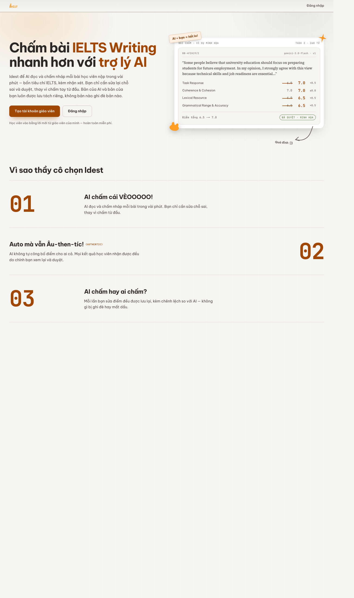
*Trang chủ Idest — điểm bắt đầu cho cả giáo viên và học viên.*

---

## 2. Tạo tài khoản

Có ba cách để có tài khoản trên Idest.

### 2.1. Giáo viên tự đăng ký

Vào trang **Đăng ký**, điền email và mật khẩu (hoặc đăng nhập nhanh bằng Google).
Đây là màn hình đăng ký khi chưa điền gì:

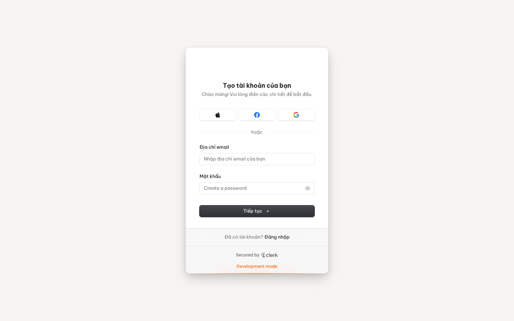
*Trang Đăng ký — chưa nhập gì.*

Đăng ký xong, trang sẽ đưa bạn tới màn hình đặt tên hiển thị (xem
[mục 2.4](#chao-mung)) trước khi vào trang chính. Đăng ký theo cách này, tài
khoản mới sẽ **mặc định là giáo viên**.

### 2.2. Học viên vào qua liên kết mời của lớp

Nếu giáo viên gửi cho bạn một liên kết mời, mở liên kết đó trước. Trang hiện
tên giáo viên và tên lớp mời bạn vào:

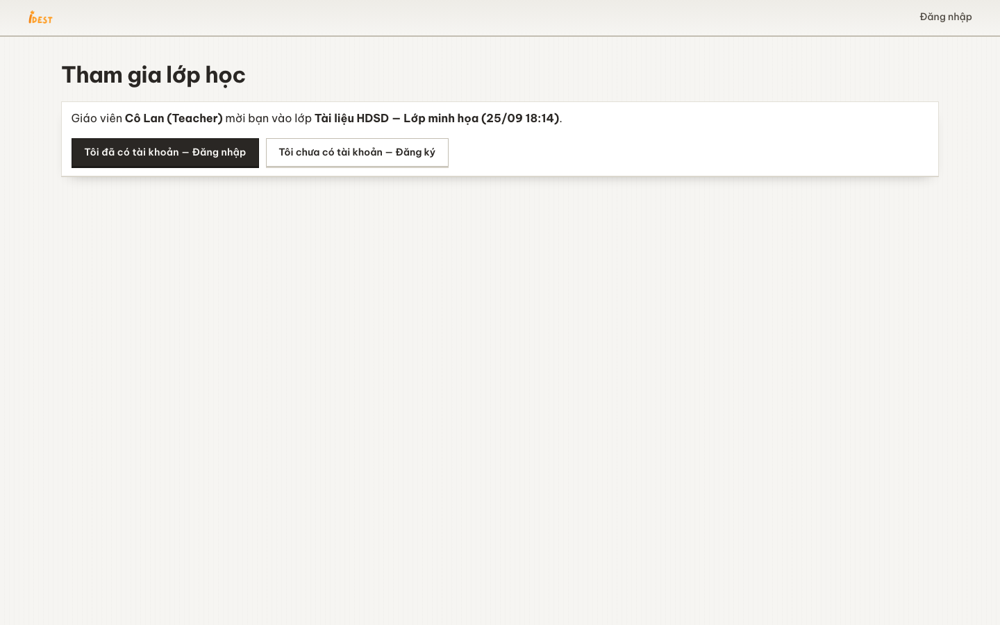
*Trang xem trước lời mời — hiện trước khi bạn đăng nhập.*

Nếu bạn **chưa có tài khoản**, bấm **"Tôi chưa có tài khoản — Đăng ký"**. Bạn sẽ
điền một form đăng ký giống hệt trang Đăng ký thường, chỉ khác là sau khi đăng
ký xong, hệ thống tự làm luôn ba việc:

1. Đặt tài khoản mới là **học viên** (không phải giáo viên như cách 2.1).
2. Đưa bạn qua màn hình đặt tên hiển thị.
3. Sau khi đặt tên xong, **tự động cho bạn vào lớp luôn** — không cần bấm gì
   thêm.

Nếu bạn **đã có tài khoản học viên** rồi, bấm **"Tôi đã có tài khoản — Đăng
nhập"**. Đăng nhập xong, trang sẽ quay lại đúng chỗ này với nút **"Tham gia
lớp"** để bạn xác nhận.

Một điều cần lưu ý: nếu bạn đang đăng nhập bằng tài khoản **giáo viên** mà mở
liên kết mời học viên, hệ thống sẽ báo tài khoản này không phải học viên và mời
bạn đăng xuất để đổi sang tài khoản khác. Một liên kết mời học viên không thể
đổi vai trò của một tài khoản đã có sẵn.

### 2.3. Học viên được mời qua email

Ở [mục Mời học viên](#moi-hoc-vien), giáo viên có thể gửi lời mời thẳng tới một
địa chỉ email, thay vì gửi một liên kết. Học viên nhận email mời, bấm vào liên
kết trong email sẽ tới ngay trang đăng ký. Tài khoản tạo ra theo cách này cũng
tự động là học viên, và cũng đi qua bước đặt tên hiển thị như trên.

Nếu bạn đang đăng nhập bằng một tài khoản khác vai trò (ví dụ tài khoản giáo
viên) rồi mở lại email mời đó, hệ thống sẽ chặn lại và giải thích rõ: *"Đây là
lời mời dành cho học viên, nhưng bạn đang đăng nhập bằng tài khoản giáo viên."*
— kèm nút đăng xuất để bạn thử lại bằng tài khoản khác.

### 2.4. Màn hình "Chào mừng bạn!" — đặt tên hiển thị

Dù đi theo đường nào ở trên, một tài khoản **hoàn toàn mới** đều dừng ở màn
hình này trước, để đặt tên hiển thị — cái tên mà giáo viên và học viên khác
trong lớp sẽ nhìn thấy:

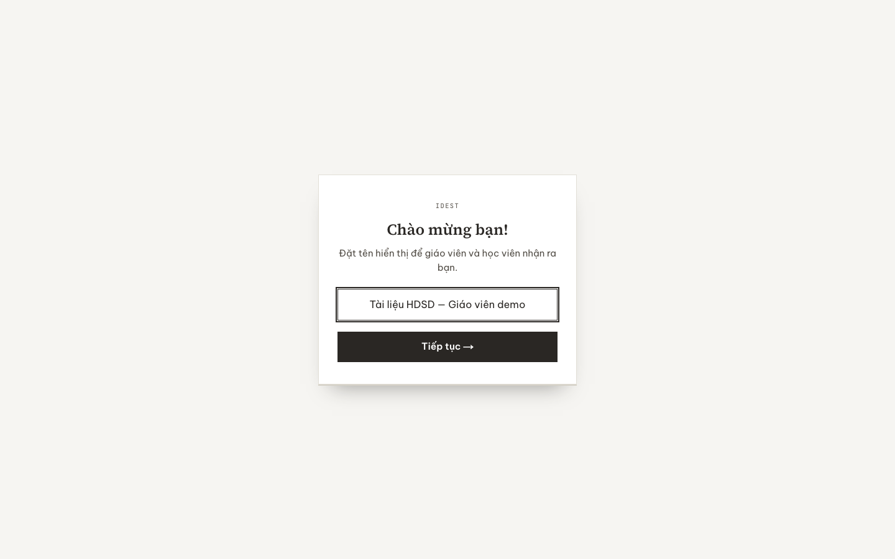
*Bước duy nhất trước khi vào trang chính lần đầu: đặt tên hiển thị.*

Bấm **"Tiếp tục →"**, trang hiện vài dòng chờ ngắn trong lúc chuẩn bị, rồi tự
đưa bạn tới đúng trang chính theo vai trò của bạn (nếu bạn tới từ một liên kết
mời, trang cũng tự cho bạn vào lớp đó luôn).

---

## 3. Đăng nhập

Vào trang **Đăng nhập**, nhập email và mật khẩu (hoặc cách đăng nhập khác nếu
có).

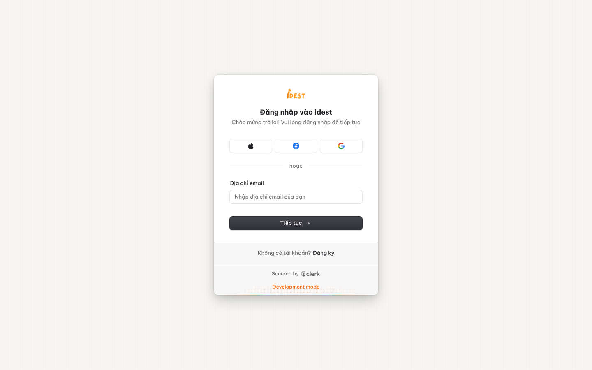
*Trang Đăng nhập — chưa nhập gì.*

Đăng nhập xong, trang tự đưa bạn tới đúng nơi theo vai trò tài khoản — không có
bước chọn vai trò thủ công.

### Giáo viên đăng nhập vào đâu

Giáo viên vào thẳng trang **"Tổng quan"**: vài ô số liệu nhanh (chờ AI chấm,
chờ giáo viên, đang sửa, đã duyệt, AI chấm lỗi, yêu cầu làm lại), lối vào nhanh
tới các mục Bài tập / Lớp học / Bài nộp / Cài đặt, và danh sách **"Bài cần chú
ý"** — những bài đang chờ xử lý, bài mới nhất hiện trước.

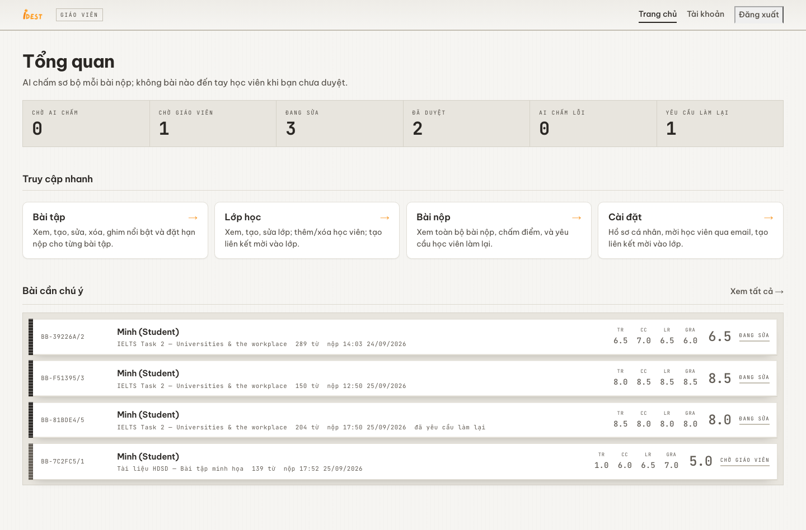
*Trang Tổng quan của một giáo viên đã có lớp và bài nộp.*

Một tài khoản giáo viên **vừa tạo** trông khác hẳn — gần như mọi số liệu đều
bằng 0, vì chưa có gì để chấm:

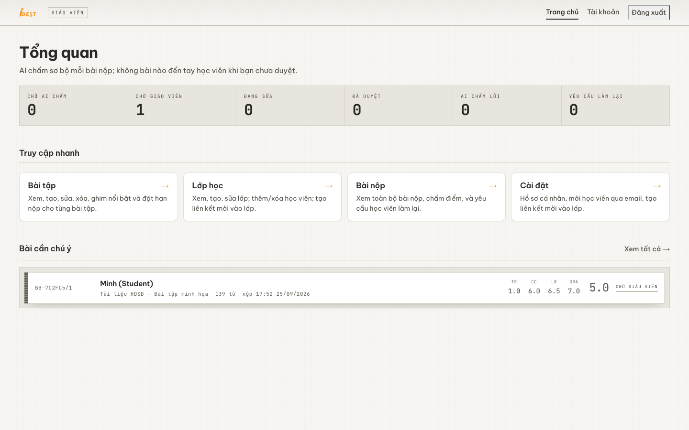
*Trang Tổng quan ngay sau khi đăng ký — gần như chưa có gì.*

Từ menu, giáo viên có thể vào mục **"Bài nộp"** để xem toàn bộ bài nộp của mọi
bài tập ở một chỗ, lọc theo trạng thái (Tất cả / Chờ giáo viên / Đang sửa / Đã
duyệt / Chấm lỗi / Nghi ngờ vi phạm) và tìm theo tên học viên hoặc tên bài tập:

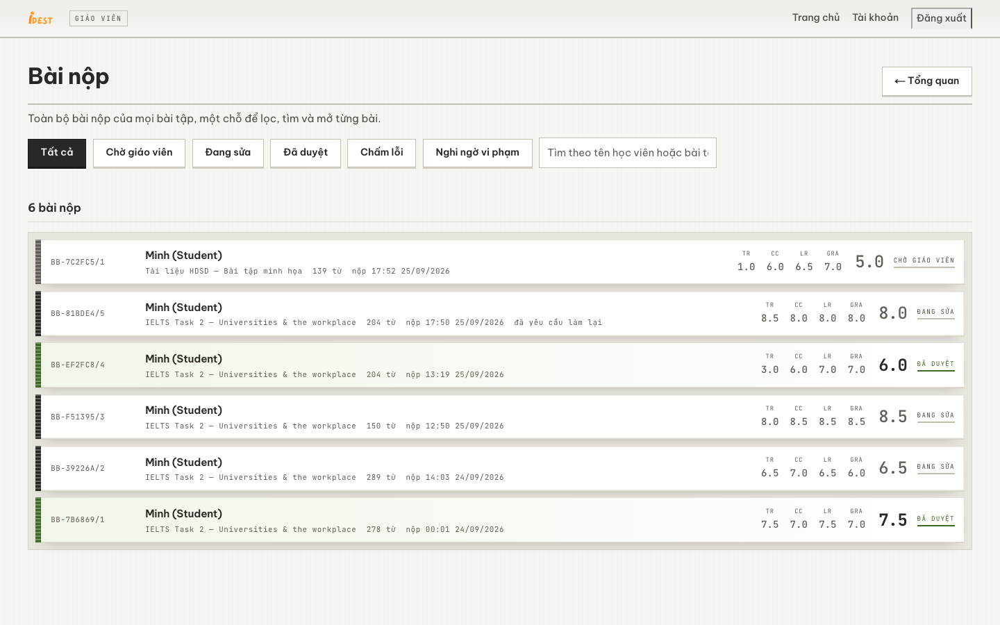
*Trang "Bài nộp" — toàn bộ bài nộp, lọc và tìm được.*

### Học viên đăng nhập vào đâu

Học viên vào thẳng trang **"Bài viết của bạn"**: một bài tập được đề xuất lớn
ở đầu trang (bài giáo viên ghim nổi bật, hoặc nếu không có bài nào được ghim
thì là bài gần hạn nộp nhất), danh sách các bài tập khác đang mở, và danh sách
bài đã nộp kèm trạng thái.

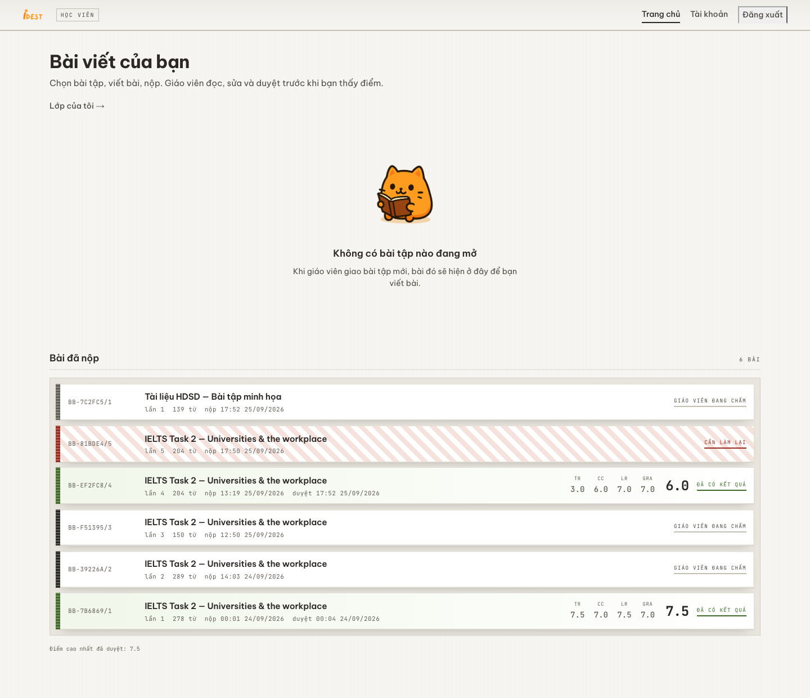
*Trang "Bài viết của bạn" — màn hình chính của học viên.*

Từ đây, học viên bấm **"Lớp của tôi"** để xem các lớp mình đang tham gia:

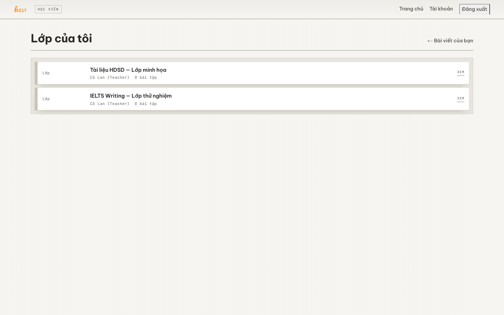
*Trang "Lớp của tôi" — các lớp học viên đang tham gia.*

---

## 4. Quản lý lớp

Một lớp là một nhóm học viên. Khi ra bài tập, giáo viên có thể giao riêng cho
một lớp, hoặc để mở cho tất cả học viên của mình (xem [mục 6](#quan-ly-bai-tap)).

Vào mục **"Lớp học"** từ menu. Với một tài khoản đã có lớp, trang trông như
sau:

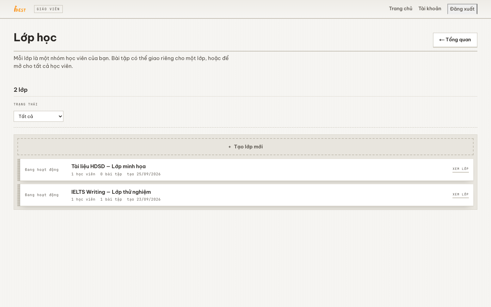
*Trang "Lớp học" — mỗi thẻ hiện số học viên và số bài tập của lớp đó.*

Với một tài khoản chưa tạo lớp nào, trang hiện "0 lớp" và chỉ có nút tạo lớp
mới:

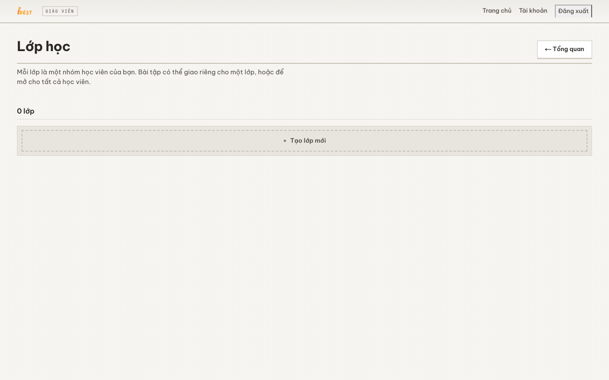
*Trang "Lớp học" khi chưa có lớp nào.*

### 4.1. Tạo lớp mới

Bấm **"Tạo lớp mới"**, điền **Tên lớp** (bắt buộc) và **Mô tả** (không bắt
buộc):

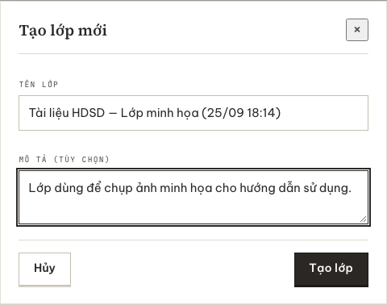
*Hộp thoại "Tạo lớp mới" — chỉ cần điền tên lớp là tạo được.*

Bấm **"Tạo lớp"**. Lớp mới tạo chưa có gì cả — 0 học viên, 0 bài tập, 0 liên
kết mời:

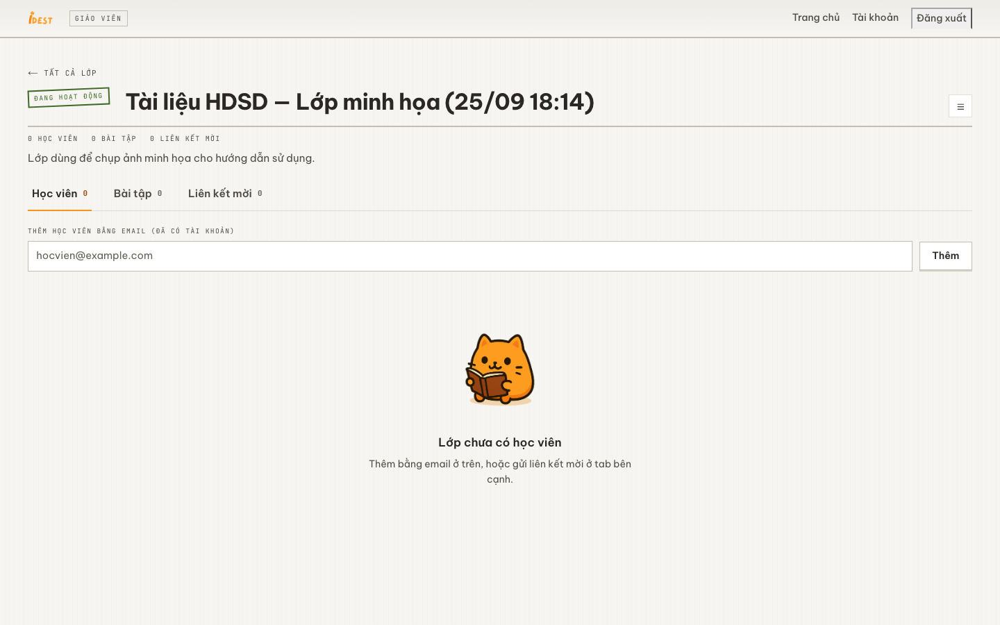
*Trang chi tiết một lớp vừa tạo — chưa có học viên, bài tập hay liên kết mời.*

### 4.2. Ba mục của một lớp: Học viên / Bài tập / Liên kết mời

Ngay dưới tên lớp là ba nút chuyển mục, bấm để mở hoặc đóng (bấm lại nút đang
mở sẽ đóng nó lại, không phải chuyển sang mục khác):

- **Học viên** — danh sách học viên trong lớp, ô thêm học viên bằng email, và
  ô tìm kiếm khi lớp đông người.
- **Bài tập** — danh sách bài tập đã giao riêng cho lớp này.
- **Liên kết mời** — các liên kết mời học viên tự vào lớp, xem thêm ở
  [mục 5](#moi-hoc-vien).

Mục **Bài tập** của một lớp mới, chưa giao bài nào, trông như sau:

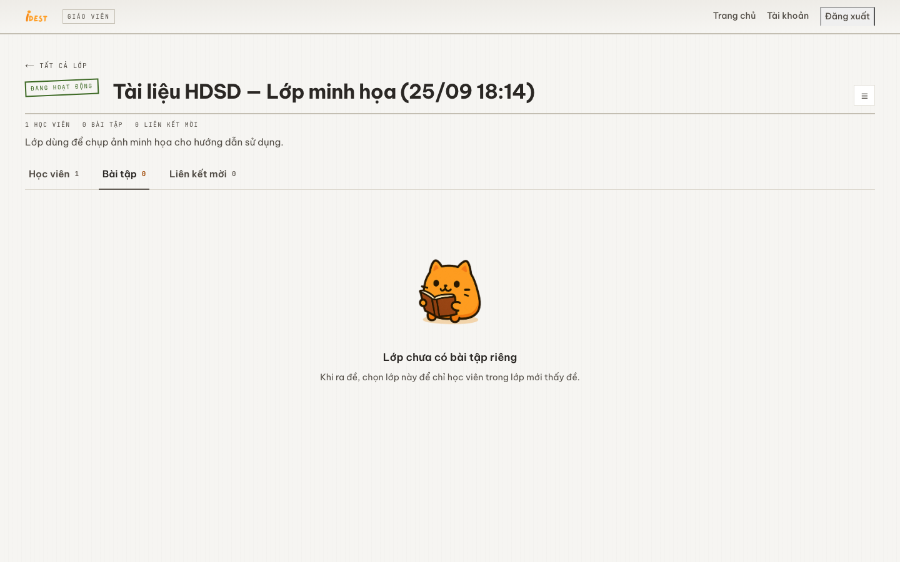
*Mục "Bài tập" — trống cho tới khi giáo viên giao một bài và chọn đúng lớp này.*

### 4.3. Sửa tên/mô tả, lưu trữ, xóa lớp

Bấm **"Tùy chọn lớp"** ở góc phải để mở menu:

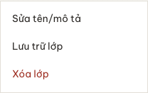
*Menu "Tùy chọn lớp" — ba lựa chọn: sửa, lưu trữ, xóa.*

- **"Sửa tên/mô tả"** mở một hộp thoại nhỏ để đổi tên và mô tả lớp:

  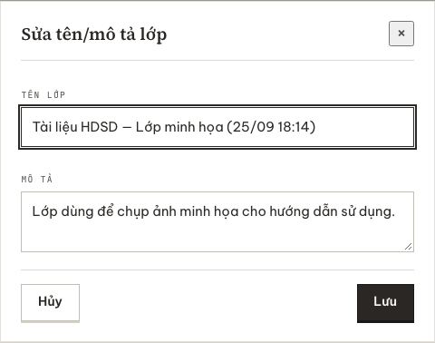
  *Hộp thoại "Sửa tên/mô tả lớp".*

- **"Lưu trữ lớp"** cất lớp sang trạng thái *Lưu trữ* — lớp không nhận thêm
  học viên mới qua liên kết mời nữa, nhưng mọi dữ liệu cũ (bài tập, bài nộp,
  điểm) vẫn giữ nguyên. Muốn dùng lại lớp, bấm nút "Mở lại lớp" bất cứ lúc nào.
- **"Xóa lớp"** cần xác nhận thêm, và bị chặn nếu lớp còn bài tập chưa đóng.
  Cảnh báo hiện đúng như sau: *"Xóa hẳn lớp "…"? Bài tập phải đóng hết trước.
  Không thể hoàn tác."* Vì đây là thao tác không hoàn tác được, tài liệu này
  không chụp ảnh lúc xóa thật.

### 4.4. Thêm học viên bằng email

Trong mục **Học viên**, gõ email một học viên **đã có tài khoản** vào ô, bấm
**"Thêm"**. Cách này khác với "mời qua email" ở mục 5: ở đây học viên phải đã
có tài khoản sẵn, việc thêm vào lớp diễn ra ngay lập tức, học viên không cần
xác nhận gì thêm.

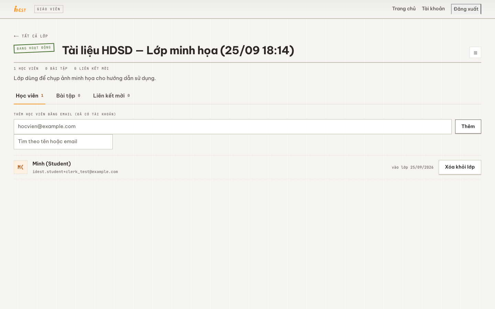
*Mục "Học viên" sau khi thêm một học viên đã có tài khoản vào lớp.*

---

## 5. Mời học viên

Có hai cách đưa học viên vào lớp: **chia sẻ một liên kết mời**, hoặc **gửi lời
mời qua email**. Cả hai đều làm được từ mục **Liên kết mời** của một lớp, hoặc
từ trang **Cài đặt** của giáo viên.

### 5.1. Tạo và chia sẻ liên kết mời

Vào mục **"Liên kết mời"** của một lớp. Khi lớp chưa có liên kết nào:

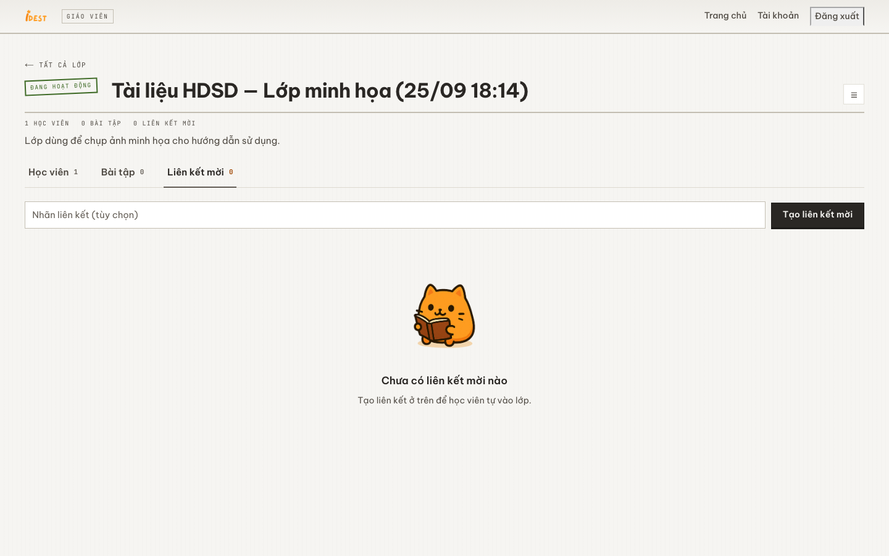
*Mục "Liên kết mời" — trống, có ô tạo liên kết mới ở trên.*

Điền **Nhãn liên kết** nếu muốn (giúp bạn nhớ liên kết này gửi cho nhóm nào, ví
dụ "Nhóm buổi tối"), rồi bấm **"Tạo liên kết mời"**. Trang trả về một đường link
đầy đủ, kèm mã QR để quét trực tiếp:

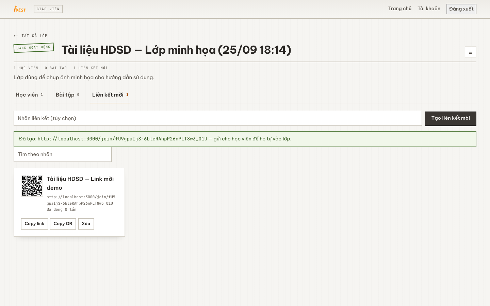
*Sau khi tạo — có đường link đầy đủ, nút "Copy link" và "Copy QR" để chia sẻ.*

Gửi đường link này (hoặc mã QR) cho học viên bằng bất kỳ cách nào — tin nhắn,
email riêng, nhóm chat của lớp. Người nhận mở link sẽ thấy đúng trang xem
trước đã nói ở [mục 2.2](#tao-tai-khoan): tên giáo viên, tên lớp, và nút vào
theo tài khoản mới hoặc tài khoản đã có.

**Thu hồi một liên kết:** bấm **"Xóa"** trên liên kết đó trong danh sách. Sau
khi xóa, liên kết không còn trong danh sách của lớp nữa:

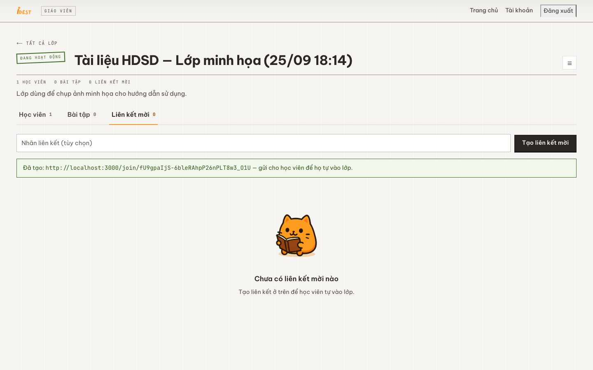
*Sau khi bấm "Xóa" trên một liên kết — liên kết không còn trong danh sách nữa.*

Ai đó cầm đường link cũ mở lại sau khi liên kết đã bị thu hồi sẽ thấy:

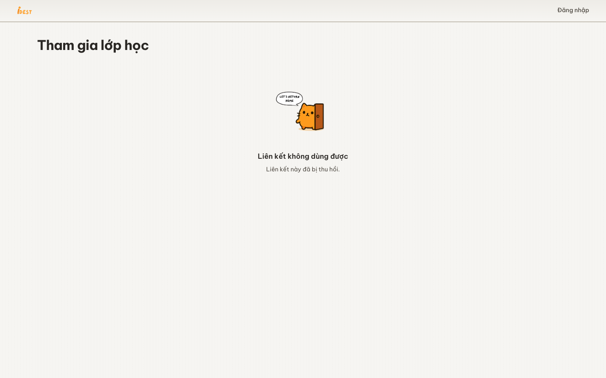
*Trang lời mời khi liên kết đã bị thu hồi — "Liên kết này đã bị thu hồi."*

### 5.2. Mời một học viên qua email

Vào trang **Cài đặt** — mục **"Mời học viên qua email"** chỉ hiện với tài
khoản vai trò giáo viên. Nếu giáo viên **chưa có lớp nào**, mục tạo liên kết
mời theo lớp (ngay bên dưới) sẽ nhắc bạn tạo lớp trước. Đây cũng là trang có
mục **Hồ sơ** và **Vùng nguy hiểm** ở phía dưới, sẽ nói kỹ hơn ở
[mục 10](#ho-so-ca-nhan):

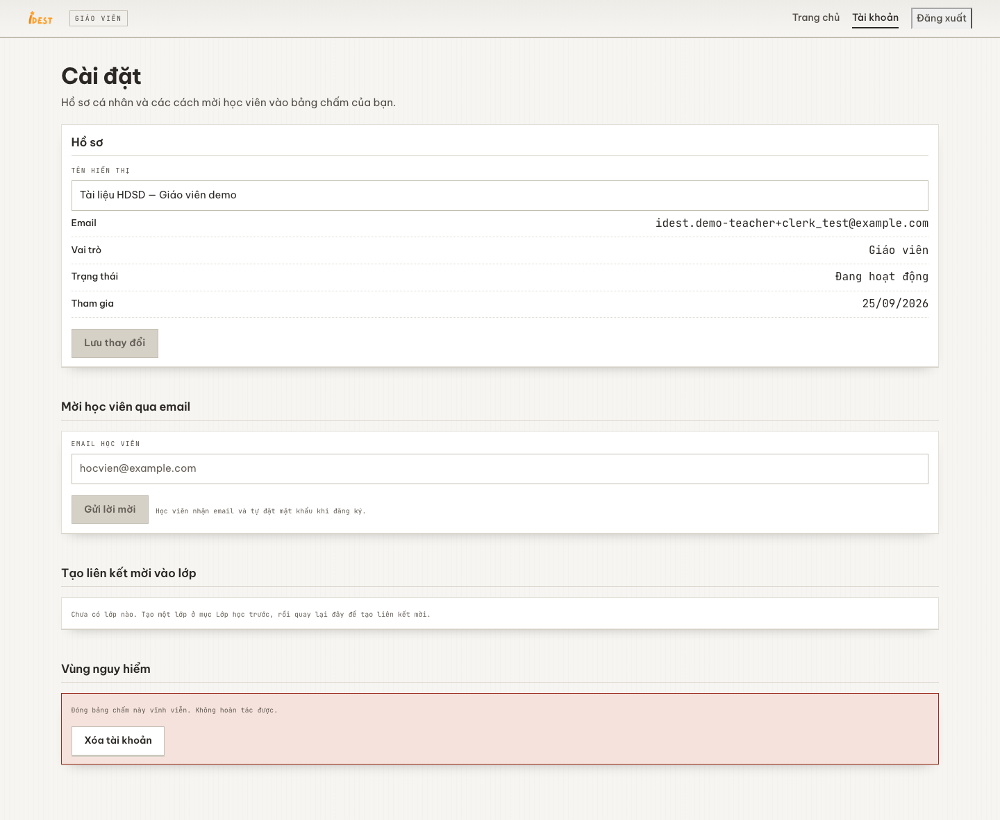
*Trang Cài đặt — phần trên là Hồ sơ, giữa là hai cách mời, dưới cùng là Vùng
nguy hiểm.*

Nhập email học viên, bấm **"Gửi lời mời"**:

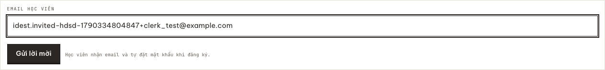
*Mục "Mời học viên qua email" — điền email rồi gửi.*

Gửi xong, trang xác nhận ngay:

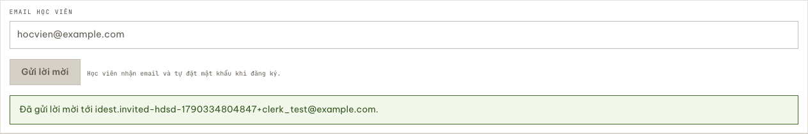
*"Đã gửi lời mời tới ..." — học viên nhận email và tự đặt mật khẩu khi đăng ký.*

Mời qua email tạo ra một **lời mời lập tài khoản**, chứ chưa gắn ngay vào một
lớp cụ thể trên màn hình này. Người được mời sẽ tự đăng ký tài khoản học viên
theo đúng cách ở [mục 2.3](#tao-tai-khoan). Nếu muốn mời thẳng vào một lớp cụ
thể, hãy dùng liên kết mời ở mục 5.1 thay vì cách này.

---

## 6. Quản lý bài tập

Vào mục **"Bài tập"** từ menu:

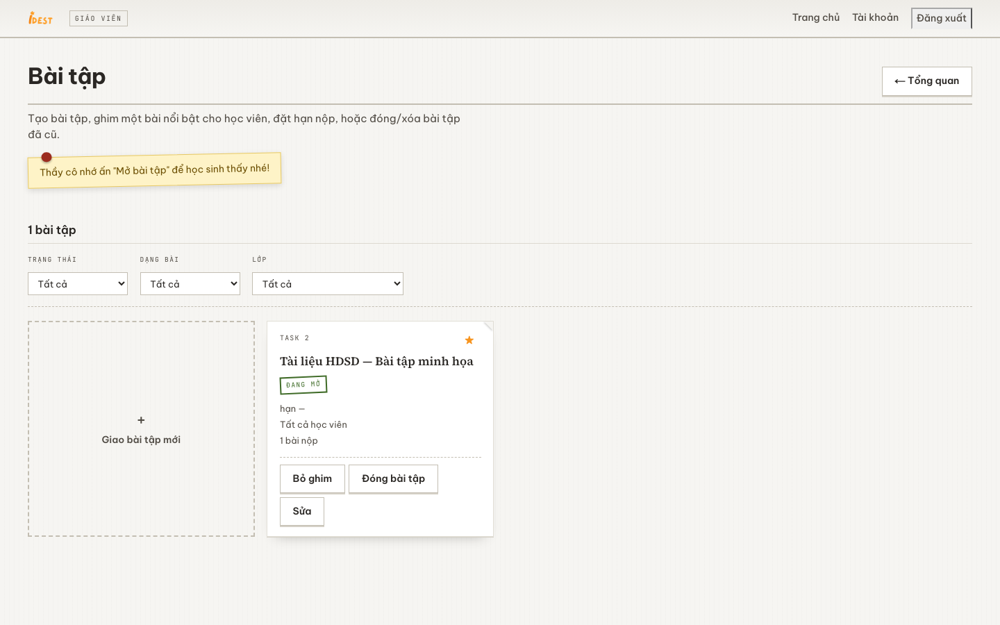
*Trang "Bài tập" — có bộ lọc theo trạng thái, dạng bài và lớp.*

Trang này luôn nhắc một điều dễ quên: *"Thầy cô nhớ ấn 'Mở bài tập' để học sinh
thấy nhé!"* Bài tập mới tạo ở trạng thái **Bản nháp**, học viên chưa thấy được
cho tới khi giáo viên chủ động mở.

### 6.1. Tạo bài tập — hai bước

Bấm **"Giao bài tập mới"**. Một biểu mẫu hiện ra theo hai bước: **Nội dung**
rồi **Lịch & lớp**.

**Bước 1 — Nội dung:** điền **Tiêu đề**, chọn **Dạng bài** (Task 1 hoặc
Task 2), điền **Đề bài** (tiếng Anh).

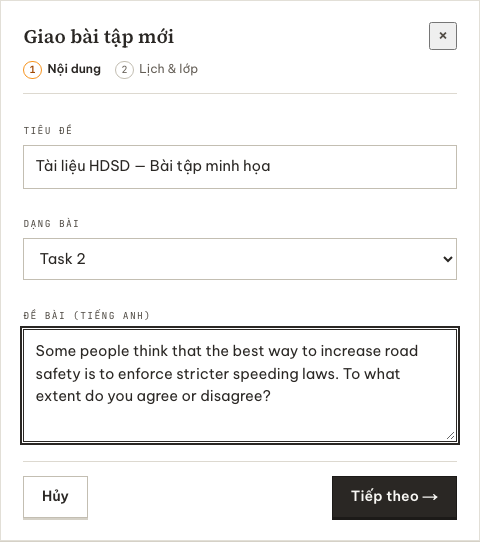
*Bước 1/2 — Nội dung: tiêu đề, dạng bài và đề bài.*

Nếu chọn **Task 1**, hệ thống bắt phải thêm một ảnh biểu đồ hoặc sơ đồ minh
họa trước khi cho sang bước 2 (nếu quên, có thông báo: *"Task 1 cần có ảnh
biểu đồ/sơ đồ minh họa."*):

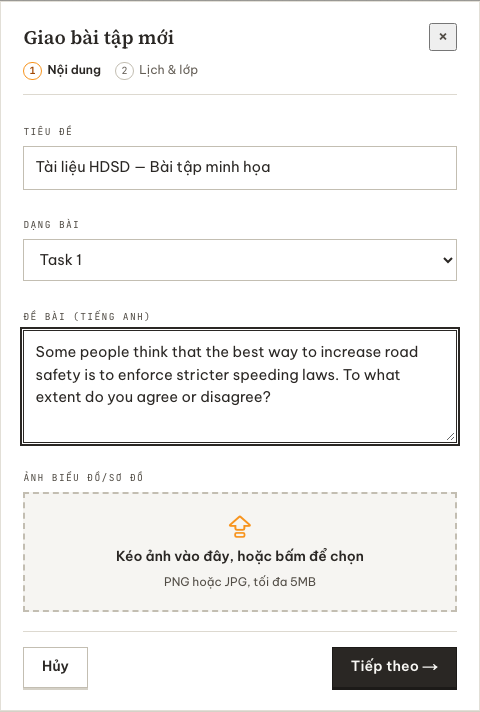
*Chọn dạng bài "Task 1" — hiện thêm ô tải ảnh biểu đồ/sơ đồ, bắt buộc.*

**Bước 2 — Lịch & lớp:** đặt **Hạn nộp** nếu muốn, và chọn **Lớp** nếu muốn —
để trống nghĩa là *"Tất cả học viên"*, tức mở cho mọi học viên chứ không riêng
một lớp nào:

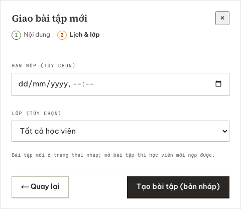
*Bước 2/2 — Lịch & lớp: đặt hạn nộp, chọn lớp hoặc để mở cho tất cả.*

Bấm **"Tạo bài tập (bản nháp)"**. Bài tập mới xuất hiện trong danh sách, ở
trạng thái **Bản nháp**:

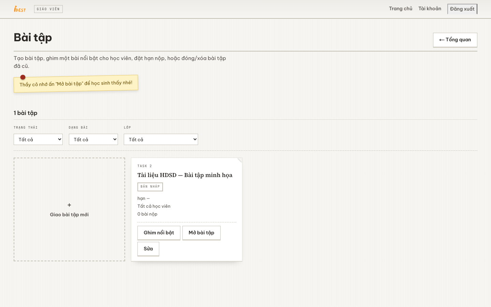
*Bài tập vừa tạo — trạng thái "Bản nháp", học viên chưa thấy được.*

### 6.2. Mở bài tập cho học viên nộp

Trên thẻ bài tập, bấm **"Mở bài tập"**. Trạng thái chuyển sang **Đang mở** —
chỉ từ lúc này học viên mới thấy và nộp bài được:

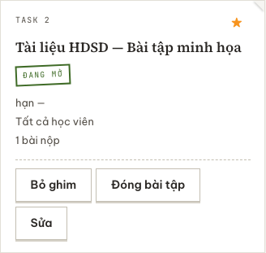
*Sau khi bấm "Mở bài tập" — trạng thái "Đang mở".*

### 6.3. Ghim nổi bật

Bấm **"Ghim nổi bật"** để đánh dấu đây là bài giáo viên muốn học viên làm
trước. Một ngôi sao (★) xuất hiện trên thẻ. Ở trang chính của học viên, bài
này sẽ được xếp đầu tiên, thay vì chỉ theo hạn nộp gần nhất (bấm lại để bỏ
ghim, nút đổi thành "Bỏ ghim"):

*Sau khi bấm "Ghim nổi bật" — có dấu ★ trên thẻ.*

### 6.4. Sửa bài tập

Bấm **"Sửa"** trên thẻ để mở hộp thoại sửa tiêu đề, đề bài, ảnh minh họa (nếu
là Task 1), hạn nộp và lớp:

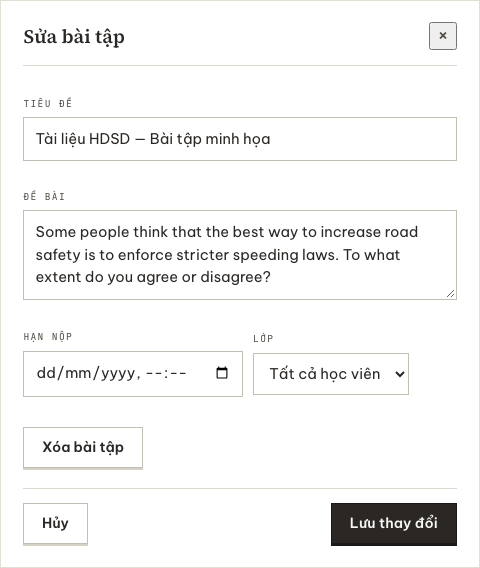
*Hộp thoại "Sửa bài tập" — sửa được mọi thứ đã nhập lúc tạo.*

### 6.5. Xóa bài tập

Trong hộp thoại sửa, bấm **"Xóa bài tập"** để mở phần xác nhận:

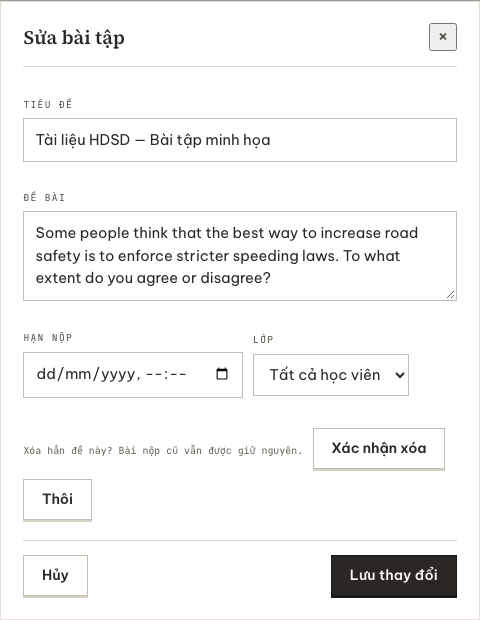
*Xác nhận xóa — nguyên văn: "Xóa hẳn đề này? Bài nộp cũ vẫn được giữ nguyên."*

Đúng như dòng cảnh báo ghi: xóa bài tập **không xóa** các bài học viên đã nộp
trước đó, chỉ xóa chính đề bài khỏi danh sách. Vì đây là thao tác không hoàn
tác được, tài liệu này chỉ minh họa tới bước xác nhận rồi bấm **"Thôi"** để
hủy, không xóa thật.

### 6.6. Đóng bài tập

Khi không muốn nhận thêm bài nộp mới nữa (ví dụ đã hết hạn), bấm **"Đóng bài
tập"**. Trạng thái chuyển về **Đã đóng**, nút đổi lại thành "Mở bài tập" nếu
sau này cần mở lại:

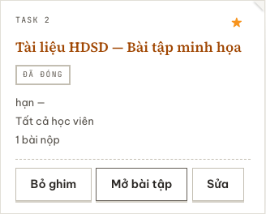
*Sau khi bấm "Đóng bài tập" — trạng thái "Đã đóng".*

### 6.7. Xem danh sách bài nộp của một bài tập

Bấm vào tiêu đề một bài tập để vào trang chi tiết, nơi liệt kê mọi bài học
viên đã nộp riêng cho bài tập này:

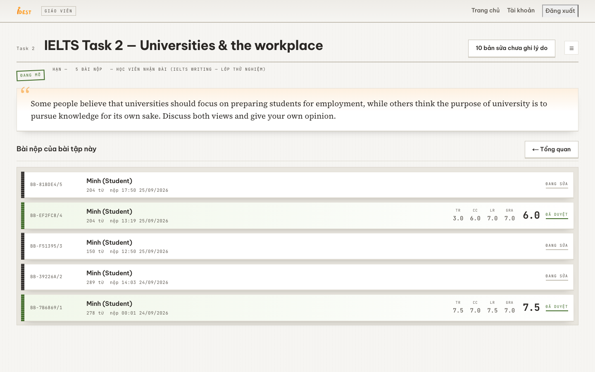
*Trang chi tiết bài tập — danh sách bài nộp riêng cho bài tập này.*

---

## 7. Học viên nộp bài

Từ trang chính hoặc trang lớp, bấm vào một bài tập đang mở để vào màn hình
viết bài. Đề bài (tiếng Anh) hiện phía trên, cùng hạn nộp và độ dài bài viết
cho phép (**10–1500 từ**):

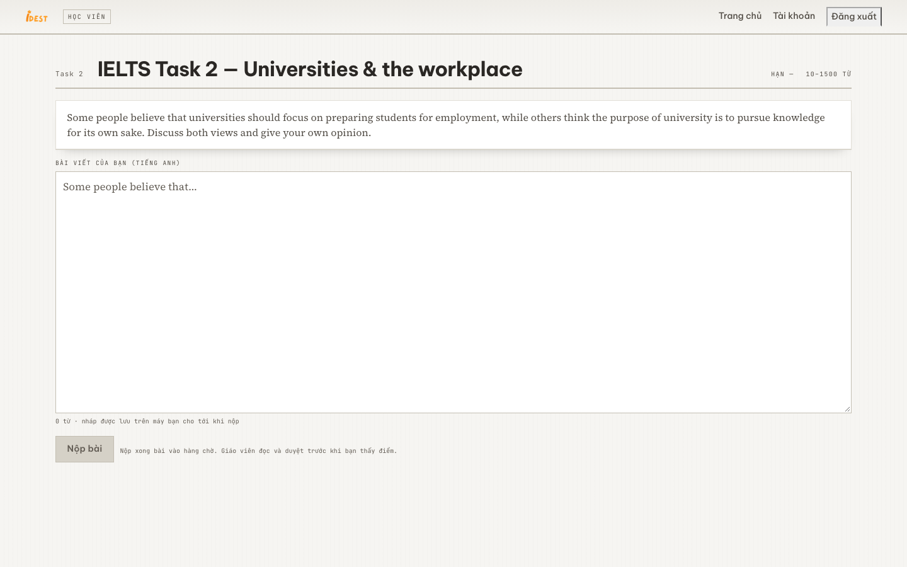
*Màn hình viết bài — ô nhập bài trống, đề bài và giới hạn từ hiện phía trên.*

### 7.1. Viết bài, đếm từ, lưu nháp tự động

Gõ trực tiếp vào ô **"Bài viết của bạn (tiếng Anh)"**. Ngay dưới ô, số từ hiện
ra theo thời gian thực, kèm dòng nhắc: *"nháp được lưu trên máy bạn cho tới
khi nộp"*. Nghĩa là: bài đang viết dở được lưu tạm ngay trên máy tính của
bạn, khoảng nửa giây sau mỗi lần gõ. Lỡ đóng tab hay mất mạng giữa chừng, mở
lại đúng bài tập đó sẽ thấy bài viết được khôi phục nguyên vẹn (kèm thông báo
*"Đã khôi phục bản nháp bạn viết dở trên máy này."*). Bản nháp này chỉ nằm
trên máy bạn — chưa gửi đi đâu cả cho tới khi bạn bấm **Nộp bài**.

Nếu bài chưa đủ **10 từ**, nút Nộp bài bị khóa và có cảnh báo:

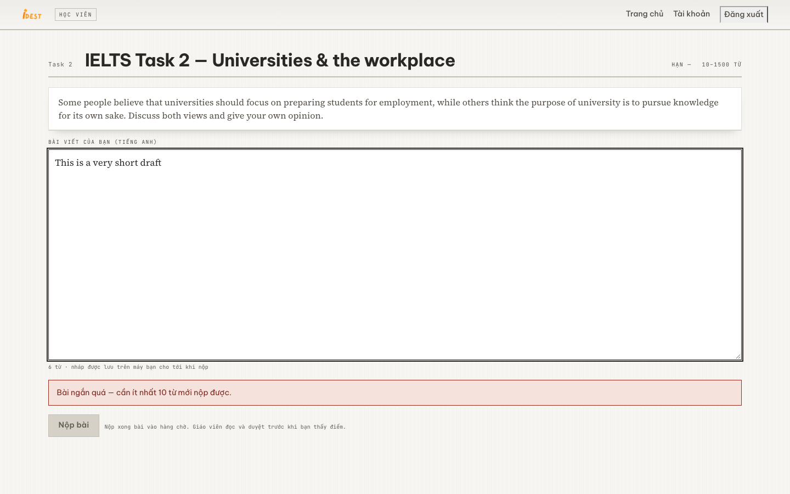
*"Bài ngắn quá — cần ít nhất 10 từ mới nộp được."*

Viết đủ độ dài (10–1500 từ), nút **"Nộp bài"** sáng lên và bấm được:

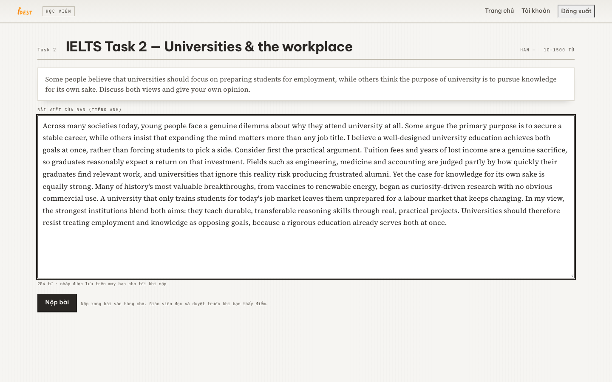
*Bài đã đủ độ dài — nút "Nộp bài" sẵn sàng.*

(Nếu bài dài quá 1500 từ, cũng có cảnh báo tương tự, yêu cầu bớt bớt số từ
thừa trước khi nộp được.)

### 7.2. Sau khi nộp

Bấm **"Nộp bài"**, trang đưa bạn sang bài nộp vừa tạo. Với một bài nộp **lần
đầu tiên** cho một bài tập (chưa từng được yêu cầu làm lại), trang hiện một
thông báo chờ đơn giản:

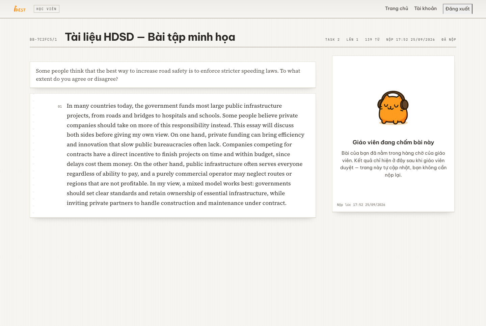
*Ngay sau khi nộp — "Giáo viên đang chấm bài này. Bài của bạn đã nằm trong
hàng chờ của giáo viên."*

Trang này tự cập nhật, bạn không cần tải lại hay nộp lại. Trong lúc này, AI
đang chấm thử phía sau (thường mất vài giây tới vài chục giây), nhưng **bản
chấm của AI không hiện ra ở đây**. Học viên chỉ thấy một trong hai trạng thái:
"đang chờ" hoặc "đã có kết quả". Điểm cụ thể chỉ xuất hiện sau khi giáo viên
duyệt — xem [mục 9](#sau-khi-duyet).

### 7.3. Không thể nộp lại tùy ý

Trong lúc bài nộp còn đang chờ xử lý (và chưa được yêu cầu làm lại), nếu học
viên quay lại đúng trang bài tập đó để thử viết bài khác, trang sẽ chặn lại:

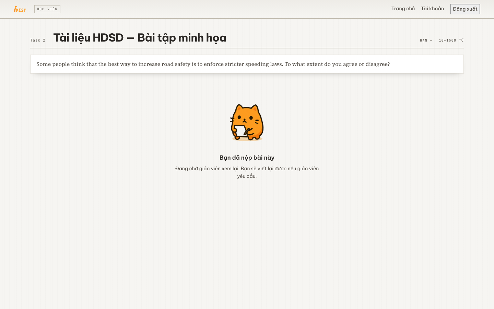
*"Bạn đã nộp bài này — Đang chờ giáo viên xem lại. Bạn sẽ viết lại được nếu
giáo viên yêu cầu."*

Đây chính là điều đã nói ở mục 1: mỗi học viên chỉ được nộp một bài đang chờ
xử lý cho mỗi bài tập. Bài vừa nộp sẽ khóa việc nộp thêm ngay lập tức, và chỉ
mở lại khi giáo viên chủ động yêu cầu làm lại (xem [mục 9.3](#yeu-cau-lam-lai)).
Phần [Câu hỏi thường gặp](#cau-hoi-thuong-gap) giải thích rõ hơn vì sao hệ
thống làm vậy.

---

## 8. Chấm bài

Giáo viên vào mục **"Bài nộp"**, hoặc vào trang chi tiết một bài tập, rồi bấm
vào một bài để vào màn hình chấm. Đây là màn hình quan trọng nhất của Idest
với giáo viên.

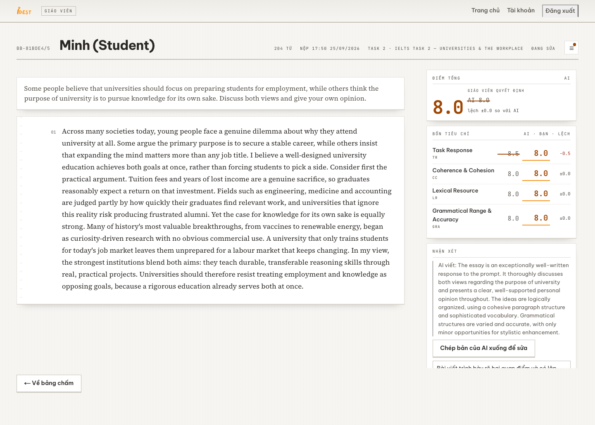
*Toàn cảnh màn hình chấm bài — cột trái là bài viết, cột phải là điểm và nhận
xét.*

Dòng trên cùng ghi: mã bài nộp và số lần nộp, tên học viên, số từ, thời điểm
nộp, tên bài tập, và trạng thái hiện tại. Ở góc phải có nút **☰ "Thêm tùy
chọn"** — bấm vào để mở thêm các lựa chọn ít dùng hơn: yêu cầu làm lại, xem
lại lịch sử chấm điểm, thử chấm lại khi AI bị lỗi. Nếu bài đang có việc cần
chú ý (AI chấm lỗi, nghi ngờ vi phạm, hoặc đang có yêu cầu làm lại còn mở), nút
này có thêm một chấm đỏ nhỏ để giáo viên không bỏ sót.

### 8.1. Cột bài viết và đánh dấu của AI

Cột trái hiện đề bài rồi tới bài viết, chia theo từng đoạn có đánh số. Nếu AI
đã chấm xong, ngay dưới bài viết là mục **"AI đánh dấu theo câu"**: từng câu
AI thấy đáng chú ý, kèm câu gốc, câu AI gợi ý sửa, và một câu giải thích ngắn
vì sao:

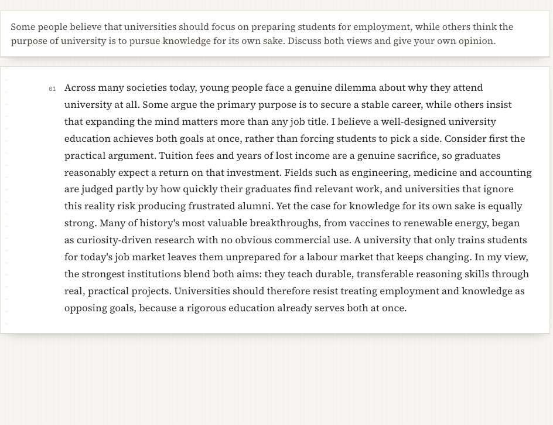
*Cột bài viết — mỗi đánh dấu của AI gồm câu gốc, câu gợi ý sửa và lý do.*

### 8.2. Điểm tổng

Mục **"Điểm tổng"** ở đầu cột phải hiện con số lớn nhất trên trang. Trước khi
giáo viên sửa gì, đây là điểm AI chấm (có ghi rõ tên và phiên bản AI đã dùng).
Ngay khi giáo viên sửa bất kỳ tiêu chí nào, dòng chú thích đổi từ *"AI chấm sơ
bộ"* sang *"Giáo viên quyết định"*, điểm AI cũ bị gạch ngang để so sánh, và có
thêm dòng cho biết mức chênh lệch so với AI:

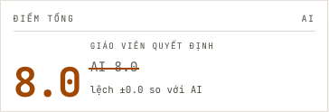
*"Điểm tổng" — điểm hiện tại, điểm AI (nếu đã bị sửa) và mức chênh lệch.*

Nếu bài chưa có bản AI chấm (đang chờ AI, hoặc AI đang gặp sự cố), giáo viên
vẫn chấm trực tiếp được như bình thường. Dòng chú thích khi đó đổi thành *"Giáo
viên chấm trực tiếp"*, kèm một dòng nhắc: *"Chưa có bản chấm của AI... Bạn có
thể chấm trực tiếp; kết quả vẫn duyệt được bình thường."*

### 8.3. Bốn tiêu chí: AI · giáo viên · lệch

Mục **"Bốn tiêu chí"** liệt kê Task Response, Coherence & Cohesion, Lexical
Resource, Grammatical Range & Accuracy — đúng bốn tiêu chí IELTS Writing quen
thuộc. Mỗi dòng có ba cột: điểm AI (chỉ để xem, gạch ngang nếu giáo viên sửa
khác đi), ô điểm của giáo viên có thể sửa trực tiếp, và mức chênh lệch giữa
hai điểm:

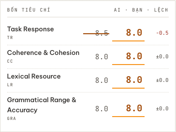
*"Bốn tiêu chí" — điểm AI, ô điểm giáo viên sửa được, và mức chênh lệch.*

Điểm phải nằm trong khoảng **0–9, theo bước 0.5**, giống thang điểm IELTS
thật. Nhập sai bước sẽ có cảnh báo ngay tại chỗ. Thiếu một trong bốn tiêu chí
thì chưa duyệt được — trang sẽ nhắc: *"Cần đủ bốn tiêu chí (0–9, bước 0.5)
thì mới duyệt được."*

### 8.4. Nhận xét: bản của AI, viết lại, và gợi ý sửa

Mục **"Nhận xét"** hiện bản tóm tắt của AI trước tiên (nếu có), dạng *"AI
viết: ..."*, kèm nút **"Chép bản của AI xuống để sửa"**. Bấm nút này để lấy
đúng nguyên văn AI viết làm điểm bắt đầu, rồi chỉnh sửa lại thay vì gõ từ đầu:

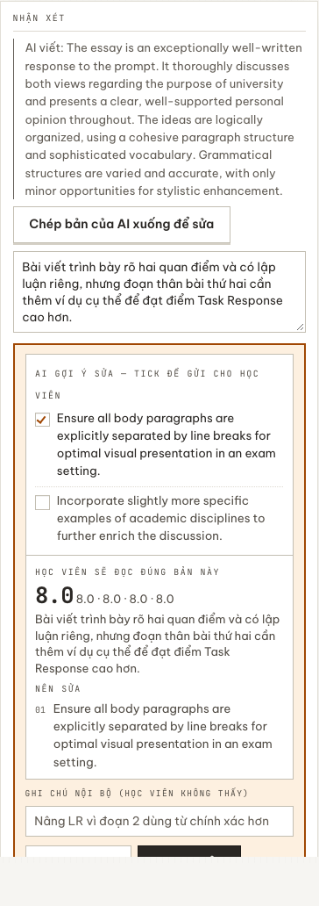
*"Nhận xét" — bản của AI phía trên, ô nhận xét của giáo viên phía dưới, và
danh sách gợi ý sửa của AI có thể tick từng ý.*

Dưới ô nhận xét là mục **"AI gợi ý sửa"** — từng gợi ý cải thiện do AI đề
xuất, mỗi gợi ý có một ô tick riêng. **Chỉ những gợi ý được tick mới gửi cho
học viên** — mặc định chưa có gợi ý nào được chọn sẵn, giáo viên phải tự chọn
ý nào hợp lý.

### 8.5. Sửa điểm và ghi chú nội bộ

Sau khi sửa điểm và viết nhận xét, còn một ô nữa: **"Ghi chú nội bộ (học viên
không thấy)"**. Đây là chỗ giáo viên ghi lại lý do sửa cho chính mình hoặc
đồng nghiệp xem sau này, ví dụ *"Nâng LR vì đoạn 2 dùng từ chính xác hơn"*.
Ghi chú này không bao giờ hiển thị cho học viên.

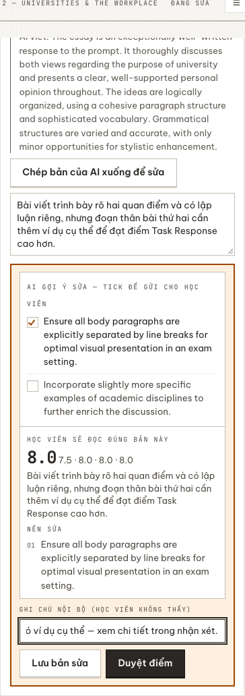
*Sau khi sửa điểm Task Response và điền ghi chú nội bộ — chưa lưu.*

Bấm **"Lưu bản sửa"** để lưu lại mà **chưa** gửi cho học viên — bài vẫn ở
trạng thái đang sửa, chưa duyệt. Cách này hữu ích khi giáo viên chấm dở, muốn
quay lại chấm tiếp sau. Mỗi lần bấm "Lưu bản sửa" tạo ra một bản ghi mới,
không xóa mất bản trước (xem [mục 8.8](#lich-su)).

### 8.6. Xem trước đúng bản học viên sẽ đọc

Ngay trước hai nút hành động, có một khối tên **"Học viên sẽ đọc đúng bản
này"** — cho xem trước chính xác điểm, nhận xét, và những gợi ý (chỉ gợi ý đã
tick) mà học viên sẽ thấy, nếu giáo viên duyệt ngay lúc này:

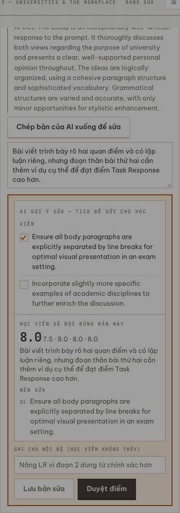
*"Học viên sẽ đọc đúng bản này" — xem trước điểm, nhận xét và gợi ý trước khi
duyệt.*

### 8.7. Duyệt điểm

Khi đã ưng ý, bấm **"Duyệt điểm"** (nút này nằm ngay trên màn hình chính,
không nằm trong ngăn kéo ☰). Nếu giáo viên chưa bấm "Lưu bản sửa" lần nào,
trang sẽ tự lưu rồi duyệt luôn trong một lần bấm. Duyệt xong, trang hiện:

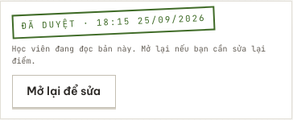
*"Đã duyệt · [thời gian]" — học viên bắt đầu thấy kết quả này ngay từ lúc
này.*

Từ lúc này, học viên đã có thể xem kết quả (xem [mục 9](#sau-khi-duyet)).

### 8.8. Lịch sử chấm điểm

Mở ngăn kéo **☰ "Thêm tùy chọn"**, mục **"Lịch sử chấm điểm"** liệt kê mọi lần
AI chấm, mọi lần giáo viên sửa, và mọi lần duyệt hoặc hủy duyệt, theo đúng
thứ tự thời gian — có ghi chú rõ *"không ghi đè"*:

*"Lịch sử chấm điểm" trong ngăn kéo "Thêm" — mọi lần AI chấm, giáo viên sửa,
và duyệt/hủy duyệt, không mất bản nào.*

Đây là bằng chứng rõ nhất cho điều đã nói ở mục 1: **không có gì bị ghi đè**.
Dù giáo viên sửa điểm bao nhiêu lần, bản chấm gốc của AI và từng bản sửa
trước đó vẫn còn nguyên trong danh sách này.

> **Chưa chụp được:** hộp thoại "Vì sao bạn sửa điểm của AI?" — một hộp thoại
> ngắn thỉnh thoảng hiện ra sau khi lưu bản sửa, mời giáo viên chọn lý do sửa
> (ví dụ "AI chấm quá rộng tay") để phục vụ thống kê nội bộ. Hộp thoại này
> không bắt buộc phải trả lời ngay, và không chặn việc duyệt điểm. Tài liệu
> chưa chụp được ảnh thật của nó nên không mô tả chi tiết giao diện ở đây.

---

## 9. Sau khi duyệt

### 9.1. Học viên xem kết quả

Sau khi giáo viên duyệt, học viên vào lại bài nộp đó sẽ thấy đầy đủ: điểm
tổng, bốn tiêu chí, nhận xét của giáo viên, và danh sách "Nên sửa" (đúng
những gợi ý giáo viên đã tick ở [mục 8.4](#cham-bai)). Học viên **không** thấy
bất kỳ dấu vết nào của điểm AI ban đầu hay các bản nháp trước đó.

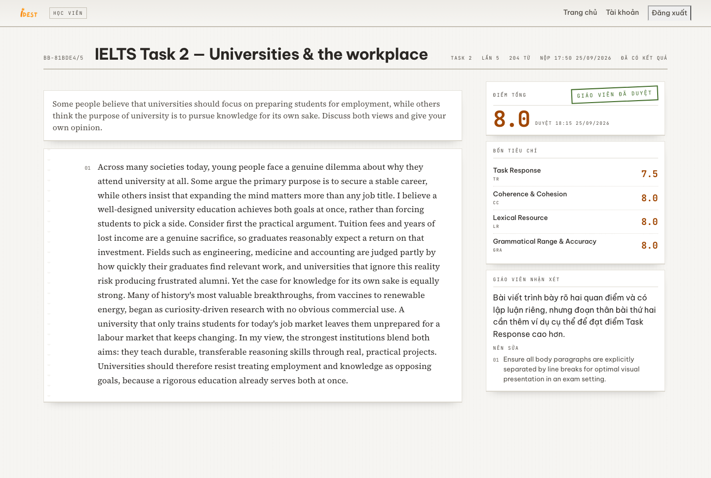
*Trang kết quả của học viên — chỉ có bản đã duyệt, không có dấu vết bản nháp
AI.*

### 9.2. Giáo viên mở lại để sửa

Với một bài **đã duyệt**, khối trạng thái trên màn hình chấm hiện dòng *"Đã
duyệt · [thời gian]"* kèm nút **"Mở lại để sửa"**:

*Bài đã duyệt — nút "Mở lại để sửa" để gỡ và chấm lại.*

Bấm **"Mở lại để sửa"**: kết quả đã duyệt sẽ tạm gỡ khỏi những gì học viên
thấy (học viên quay lại trạng thái "đang chờ"), nhưng **bản đã duyệt cũ không
bị xóa** — nó vẫn nằm nguyên trong lịch sử chấm điểm, chỉ được đánh dấu là "Đã
hủy duyệt". Đây vẫn đúng quy tắc không ghi đè đã nói ở mục 1. Giáo viên sửa
điểm hoặc nhận xét như bình thường rồi duyệt lại là xong; học viên chỉ thấy
đúng bản mới nhất được duyệt tại một thời điểm.

### 9.3. Yêu cầu học viên làm lại

Đây là cách **duy nhất** để mở lại lượt nộp cho một học viên. Không có cách
nào khác để học viên tự nộp bài thứ hai cho cùng một bài tập.

Mở ngăn kéo **☰ "Thêm tùy chọn"** (nút này chỉ hiện với bài **chưa** ở trạng
thái đã duyệt — nếu bài đã duyệt rồi, hãy "Mở lại để sửa" trước như mục 9.2,
tải lại trang, rồi mới mở ngăn kéo):

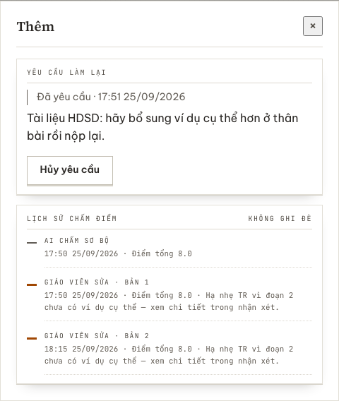
*Ngăn kéo "Thêm" — mục "Yêu cầu làm lại", trước khi bấm nút bắt đầu.*

Bấm **"Yêu cầu học viên làm lại"**, điền **Lý do — học viên sẽ đọc dòng này**
(ví dụ: *"Bài chưa đúng dạng Task 2, em viết lại theo đề nhé."*):

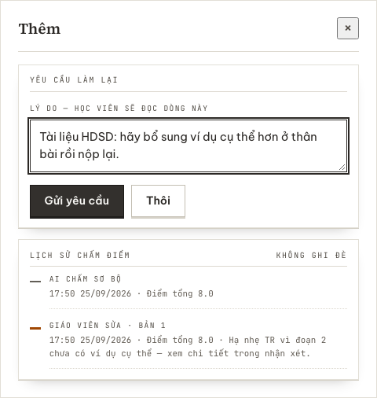
*Điền lý do yêu cầu làm lại — nội dung này học viên sẽ đọc được.*

Bấm **"Gửi yêu cầu"**. Trạng thái chuyển thành *"Đã yêu cầu ·"* kèm đúng lý do
vừa gửi, và nút đổi thành **"Hủy yêu cầu"** nếu giáo viên đổi ý:

*"Đã yêu cầu ·" — học viên giờ có thể viết và nộp một lượt mới cho bài tập
này.*

Từ lúc này, học viên mở lại đúng bài tập đó sẽ thấy một dòng nhắc lý do giáo
viên đưa ra, cùng một liên kết **"Viết lại bài"** — thay vì bị chặn như ở
[mục 7.3](#hoc-vien-nop-bai). Bài viết cũ, điểm cũ và mọi nhận xét trước đó
vẫn còn nguyên trong lịch sử, không mất gì — chỉ có thêm một lượt nộp mới.

---

## 10. Hồ sơ cá nhân và xóa tài khoản

Trang **Cài đặt** có mục **Hồ sơ** để đổi tên hiển thị, cùng vài thông tin cố
định không sửa được từ giao diện: email, vai trò, trạng thái tài khoản, ngày
tham gia.

Với tài khoản **giáo viên**, cuối trang Cài đặt có mục **"Vùng nguy hiểm"** —
nơi xóa vĩnh viễn tài khoản (ảnh minh họa ở [mục 5.2](#moi-hoc-vien), phần
dưới cùng của trang Cài đặt). Vì đây là thao tác không thể hoàn tác, tài liệu
này không thao tác xóa thật, nhưng nguyên văn cảnh báo trên đó rất đáng đọc kỹ
vì nói rõ điều gì sẽ xảy ra:

> *"Xóa tài khoản sẽ gỡ khỏi bảng chấm: các đề bài bạn đã ra, các lớp và liên
> kết mời của bạn, cùng tài khoản của những học viên chỉ học với riêng bạn.
> Học viên còn đang học với giáo viên khác vẫn giữ tài khoản, chỉ rời lớp của
> bạn. Bài viết đã nộp và kết quả đã duyệt được giữ nguyên."*

Để xác nhận, giáo viên phải gõ lại đúng email của chính mình — nút xóa vĩnh
viễn chỉ bật lên khi email gõ vào khớp đúng với email tài khoản.

---

## 11. Câu hỏi thường gặp

**Vì sao học viên không tự nộp lại bài được?**
Đây là thiết kế cố ý: mỗi bài tập chỉ cho một lượt nộp đang chờ xử lý tại một
thời điểm. Nhờ vậy, mỗi bài nộp là một nỗ lực thật của học viên, và mọi lượt
nộp lại đều phải có lý do rõ ràng từ giáo viên — thay vì để học viên nộp thử
nhiều lần cho tới khi vừa ý với điểm AI. Muốn mở lại cho học viên, giáo viên
vào bài nộp đó, bấm **"Yêu cầu học viên làm lại"** — xem
[mục 9.3](#yeu-cau-lam-lai).

**Vì sao điểm của tôi có thể khác với điểm AI chấm lúc đầu?**
AI chỉ chấm thử, để giáo viên tham khảo. Giáo viên đọc qua, có thể giữ nguyên
hoặc sửa từng tiêu chí trước khi duyệt — chỉ bản **giáo viên duyệt** mới là
điểm chính thức mà học viên nhìn thấy. Nếu sau này giáo viên mở lại và sửa
thêm lần nữa, học viên sẽ thấy đúng bản mới nhất; các bản trước đó không mất
đi đâu, chỉ không còn hiển thị nữa (xem [Lịch sử chấm điểm](#lich-su)).

**AI chấm bị lỗi thì bài viết của tôi có mất không?**
Không mất. Bài viết được lưu đầy đủ ngay khi nộp, dù AI chấm thành công hay
không. Nếu một lượt AI chấm bị lỗi, giáo viên vẫn thấy đầy đủ bài viết và có
thể chấm trực tiếp bằng tay, hoặc yêu cầu hệ thống thử chấm lại bằng AI. Theo
thiết kế của hệ thống, học viên khi đó sẽ thấy một dòng thông báo nhẹ nhàng,
đại ý: *"Bài của bạn đang chờ xử lý... Lần chấm vừa rồi gặp lỗi kỹ thuật nên
kết quả đến chậm hơn bình thường. Bạn không cần nộp lại."* Tài liệu này chưa
bắt được đúng lúc để chụp ảnh tình huống đó, nên chưa có ảnh minh họa — nhưng
hành vi luôn đúng như vậy: học viên không cần nộp lại.

**Tôi nộp bài xong, đợi bao lâu thì có điểm?**
AI chấm ở chế độ nền, thường xong trong vài giây tới vài chục giây. Nhưng như
đã nhấn mạnh xuyên suốt tài liệu này: **AI chấm xong không có nghĩa là học
viên thấy điểm ngay**. Học viên chỉ thấy điểm sau khi giáo viên đọc và bấm
**Duyệt điểm** — nên thời gian chờ thật sự phụ thuộc vào khi nào giáo viên
rảnh để chấm, không chỉ phụ thuộc vào AI nhanh hay chậm.

**Giáo viên có thấy tên thật của tôi kèm bài viết không?**
Có. Giáo viên luôn thấy tên hiển thị của học viên khi chấm bài. Ngược lại, học
viên không bao giờ thấy được ghi chú riêng của giáo viên — ô "Ghi chú nội bộ
(học viên không thấy)" ở [mục 8.5](#cham-bai).

**Một bài tập "mở cho tất cả học viên" nghĩa là sao?**
Khi tạo hoặc sửa bài tập, nếu giáo viên để trống mục **Lớp**, bài tập đó sẽ
hiện cho **mọi** học viên của giáo viên đó, không riêng lớp nào cả. Nếu chọn
một lớp cụ thể, chỉ học viên trong lớp đó mới thấy bài tập.

**Xóa một bài tập có xóa luôn các bài học viên đã nộp không?**
Không. Đúng như cảnh báo lúc xóa: *"Bài nộp cũ vẫn được giữ nguyên."* Chỉ
chính đề bài bị xóa khỏi danh sách giao bài; lịch sử bài nộp, điểm và kết quả
đã duyệt liên quan tới nó không bị ảnh hưởng gì.

---

## Những gì tài liệu này chưa chụp được

Mọi ảnh trong tài liệu là ảnh chụp thật từ trang web đang chạy, bằng một kịch
bản kiểm thử tự động (không phải ảnh dựng hay chỉnh sửa). Một vài trạng thái
không thể tạo lại an toàn hoặc ổn định trong lúc chụp, nên chưa có ảnh minh
họa dù hành vi được mô tả đúng theo thiết kế thật của hệ thống:

- Hộp thoại **"Vì sao bạn sửa điểm của AI?"** — chỉ hiện có điều kiện sau một
  số lần sửa điểm nhất định, không xuất hiện ổn định để chụp.
- Màn hình bài nộp đúng vào khoảnh khắc **AI chưa chấm xong** (*"Chưa có bản
  chấm của AI"*) — AI ở đây chấm xong quá nhanh để bắt được đúng khoảnh khắc
  này.
- Màn hình học viên khi một lượt **AI chấm bị lỗi thật sự** (*"Bài của bạn
  đang chờ xử lý"*), và màn hình giáo viên xử lý một bài **bị nghi ngờ vi
  phạm** (spam, nội dung vô nghĩa...) — không có cách nào an toàn để tự tạo ra
  hai tình huống này từ giao diện.
- Hộp thoại xác nhận **"Xóa lớp?"** — nút xóa lớp có trong ảnh "Menu Tùy chọn
  lớp" ở mục 4.3, nhưng tài liệu không thao tác xóa thật một lớp nên chưa có
  ảnh hộp thoại xác nhận.
- Thao tác xóa tài khoản thật ở mục **"Vùng nguy hiểm"** — cố ý không thực
  hiện vì không thể hoàn tác; trang chứa mục này đã có ảnh chụp ở
  [mục 5.2](#moi-hoc-vien), còn nguyên văn cảnh báo được trích lại ở
  [mục 10](#ho-so-ca-nhan).

Mọi ảnh trong tài liệu dùng hai tài khoản thử nghiệm
(`idest.teacher+clerk_test@example.com`, `idest.student+clerk_test@example.com`)
và một tài khoản giáo viên demo tạo riêng để chụp ảnh minh họa. Không có email
hay dữ liệu thật của người dùng nào xuất hiện trong bất kỳ ảnh nào.
